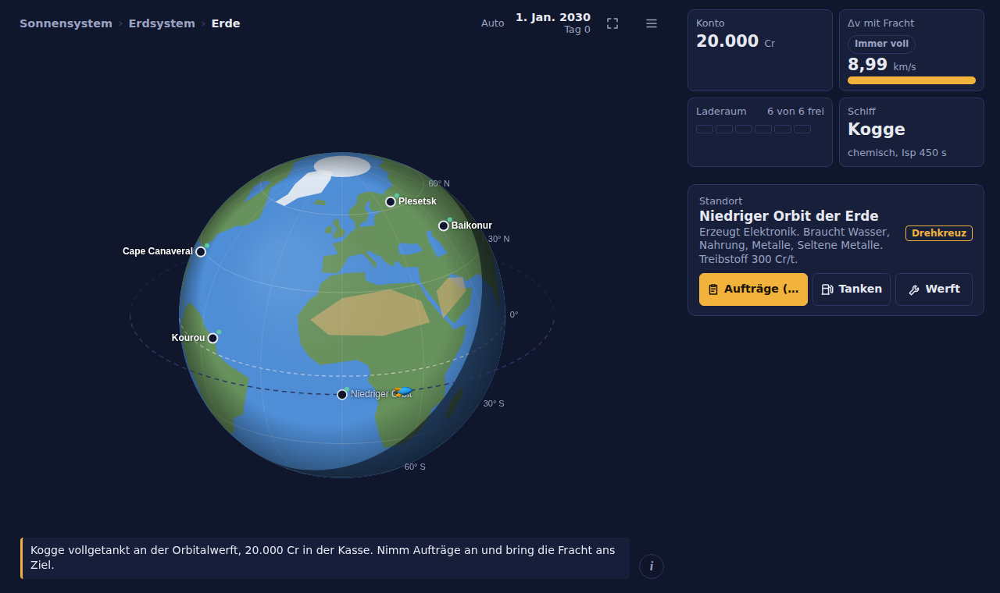

# TransferOrbit

Prototyp eines Weltraum-Handelsspiels mit echter Bahnmechanik. Du fliegst Fracht zwischen Kontoren im Sonnensystem. Jede Fahrt kostet Delta-v nach der Raketengleichung, Transfers zu anderen Planeten gehen nur in Transferfenstern. Mit dem Gewinn kaufst du größere Schiffe: Kogge → Holk → Hulk → Karacke.



## Spielen
Die ganze Seite steckt in einer einzigen Datei: `index.html`. Mit GitHub Pages läuft das Spiel unter https://scuzzar.github.io/TransferOrbit/.

Für die texturierten Planeten braucht es einen Server (die Texturen liegen in `art/texturen/`), also `npm run serve` und dann http://localhost:8765/. Direkt per Doppelklick geöffnet (`file://`) läuft das Spiel auch, dann aber in der flachen 2D-Darstellung.

- Tippen oder Klicken auf Planeten, Monde und Landeplätze wählt ein Ziel. Ein Doppelklick zoomt hinein.
- Der Routenplaner berechnet die günstigste Route, auf Wunsch fliegt sie der Autopilot.
- Tippen während eines Fluges macht die Animation schneller.
- Das Menü (☰) enthält Speichern, Laden, Zeit vergehen lassen und Neustart.

## Darstellung
Die Himmelskörper zeichnet [three.js](https://threejs.org/), als ES-Modul vom CDN geladen; es liegt nichts davon im Repo und es gibt keine Baukette. Darüber liegt weiterhin ein durchsichtiger 2D-Canvas mit Beschriftungen, Bahnen, Markierungen, Flammen und den Klickzielen. Beide nutzen dieselbe orthografische Projektion, deshalb liegen sie deckungsgleich übereinander.

Reihenfolge der Ebenen: `#cvb` (2D, hinten) – `#glc` (three.js) – `#cv` bzw. `#sys` (2D, vorne).

Fehlt WebGL, lädt three.js nicht oder ist eine Textur nicht ladbar, zeichnet der alte 2D-Weg weiter — mit Kontinenten aus Polygonen, gemalter Tag-Nacht-Grenze und der von Hand schattierten Rakete. Der Code dafür bleibt erhalten.

## Physik und Wirtschaft
- Delta-v nach Ziolkowski mit Leergewicht, Fracht und Treibstoff. Jedes Schiff hat einen eigenen Isp.
- Hohmann- bzw. Kepler-Transfers. Das nächste Fenster hängt von der echten Planetenstellung ab.
- Ballistische Hüpfer zwischen Landeplätzen, Aerobremsen bei Körpern mit Atmosphäre.
- Belohnung = K_T·m·(e^(Δv/v_e) − 1) + K_Z·Tage + K_ZT·m·Tage + 0,1·n·w (+ Anteil Startgebühr), mal einem Zufallsfaktor: meist 0,9–1,2, in 8 % der Fälle 1,4–1,9.
- Großaufträge (7–18 Container) passen nur in größere Schiffe.

## Aufbau des Repos
| Pfad | Inhalt |
|---|---|
| `index.html` | das Spiel (HTML, CSS, JS, Canvas und three.js vom CDN; nichts zu bauen) |
| `CHANGELOG.md` | Änderungsprotokoll aller Versionen |
| `art/` | Modelle, Texturen und Bilder aus [Hanseatic Galaxy](https://github.com/scuzzar/HanseaticGalaxy), siehe `art/README.md` |
| `tools/` | Python-Werkzeuge: Godot-.escn → JSON, Modelle vereinfachen, Vorschau rendern |
| `tests/` | Playwright-Tests und Bots |

## Tests
```bash
npm install            # Playwright
npx playwright install chromium
npm run serve          # in einem zweiten Terminal: Server auf Port 8765
npm test               # Regressionstest + UI-Bot (Desktop und Handy)
npm run spiel-bot      # spielt klug bis zur Karacke und protokolliert die Balance
```
- `tests/regress.js` prüft Neustart, Speichern und Laden, Strand-Logik und Tanken im Routenplaner.
- `tests/test-bot.js` klickt sich durch die Oberfläche, in einem gesperrten iframe wie auf claude.ai (`tests/harness.html`). Einstellbar mit den Umgebungsvariablen `STEPS`, `ONLY` und `LOG`.
- `tests/spiel-bot.js` spielt über die Spielfunktionen mit sofortigen Animationen.
- `tests/autopilot-ankunft.js`, `tests/rakete-bilder.js` und `tests/rakete-perf.js` sind Einzelprüfungen. `rakete-bilder.js` braucht den laufenden Server, sonst fällt die Seite auf 2D zurück.

## Herkunft der Art
Die 3D-Rakete im Spiel ist das Modell „SimpleRocket“ aus Hanseatic Galaxy, vereinfacht auf 608 Dreiecke. Die Planetentexturen kommen von I, Voyager (Apache 2.0) und Solar System Scope (CC BY). Die Lizenztexte liegen in `art/lizenzen/`.
