# Domain model

The game state `S` (`js/game/state.ts`) as objects that relate the way the things in the game do.

- The **player** has the money and keeps a **logbook**: places visited, deliveries, milestones, depots used.
- The **ship** is at a **location**: either **docked** at a **place** (node and landing site) or
  **in transit** between two planets. `ship.place` is null while in transit.
- The ship's **hold** carries the orders it has taken aboard. A **trading post** **offers** orders,
  each going to a destination post. Where an order lies is its state: open at a post, aboard in
  the hold. There is no state field that could disagree.
- A trading post keeps what it has produced and what it needs; a **hub** also stores goods for
  its region, which it passes on as short regional orders.
- The **market** holds the posts and hands out order ids. `marketAdvance()` in
  `js/game/economy.ts` runs it day by day; it needs the route graph, which the objects must not
  import.
- The fixed tables from `js/game/world.ts` (ship definitions, goods, trading post definitions)
  are referenced, never copied. A place is a value: a ship that moves gets a new one.

`Game` holds the day and is where saving starts: `S.toSave()` flattens the objects into the same
JSON a save always had, `parseSave()` in `js/game/save.ts` rebuilds them. What is under way right
now — `ship.busy`, the transfer, the autopilot — is never saved.

The objects do each change and keep it consistent; `js/game/commands.ts` decides when, plays
the animation and reports. `ARCHITECTURE.md` has the rest.

```mermaid
---
title: TransferOrbit – domain model
config:
  layout: elk
---
classDiagram
direction TB

class Game {
  +day: number
  +windowPlanet: PlanetId
  +canAct() boolean
  +postHere() TradingPost
  +orders() Order[]
  +arrive(place) void
  +toSave() SaveObj
}

namespace Player_and_ship {
  class Player {
    +credits: number
    +bankrupt: boolean
    +autoFill: boolean
    +pay(n) void
    +charge(n) void
    +canAfford(n) boolean
  }

  class Logbook {
    +visited: Set~string~
    +delivered: number
    +milestones: Set~Milestone~
    +depots: Set~string~
    +visit(place) void
    +refuelled(place) void
  }

  class Ship {
    +type: ShipId
    +fuel: number
    +dvUsed: number
    +busy: boolean
    +place() Place
    +transit() InTransit
    +cargoMass() number
    +dvAvail() number
    +dvWith(fuel, cargo) number
    +burn(dv) void
    +refuel(tons) void
    +swapTo(type) void
    +load(order) void
    +unload(order) void
    +dock(place) void
    +depart(transit) void
  }

  class Autopilot {
    +target: Target
    +mode: RouteMode
    +start: string
  }

  class Location {
    <<union>>
  }

  class Docked

  class InTransit {
    +from: PlanetId
    +to: PlanetId
    +dep: number
    +arr: number
  }
}

namespace Trade {
  class Market {
    +nextId: number
    +simulatedTo: number
    +post(id) TradingPost
    +hub(id) Hub
    +offers() Order[]
  }

  class TradingPost {
    +produced: Amounts
    +need: Amounts
    +bulkStore: Amounts
    +bulkLot: Amounts
    +needOf(good) number
    +offer(order) void
    +withdraw(order) void
  }

  class Hub {
    +store: Amounts
    +stored() number
  }

  class Order {
    +id: number
    +containers: number
    +reward: number
    +dv: number
    +days: number
    +created: number
    +deadline: number
    +expires: number
    +toHub: boolean
    +isBulk: boolean
    +fromHubStore: boolean
    +mass() number
    +payout(day) number
  }
}

namespace World_fixed_tables {
  class Place {
    <<value object>>
    +node: NodeId
    +site: string
    +body() BodyId
    +planet() PlanetId
    +post() Post
    +fuelPrice() number
    +name() string
    +is(target) boolean
  }

  class ShipDef {
    <<reference>>
    +isp: number
    +dry: number
    +cap: number
    +slots: number
    +price: number
  }

  class GoodDef {
    <<reference>>
    +m: number
    +lot: number[2]
    +rate: number
  }

  class Post {
    <<reference>>
    +name: string
    +makes: GoodId[]
    +needs: GoodId[]
  }
}

%% the player and their ship
Game "1" --> "1" Player : player
Game "1" --> "1" Ship : ship
Game "1" --> "1" Market : market
Player "1" *-- "1" Logbook : log
Ship "*" --> "1" ShipDef : def
Ship "1" *-- "1" Location : location
Ship "1" *-- "0..1" Autopilot : autopilot
Location <|-- Docked
Location <|-- InTransit
Docked "*" --> "1" Place : place

%% trade
Market "1" *-- "*" TradingPost : posts
TradingPost <|-- Hub
TradingPost "*" --> "1" Post : def
Place ..> Post : post()
TradingPost "1" o-- "*" Order : offers (from)
Order "*" --> "1" TradingPost : to
Order "*" --> "1" GoodDef : good
Ship "1" o-- "*" Order : hold

note for Order "In a post's offers it is open, in the ship's hold it is aboard.<br>No state field that could disagree."
```

