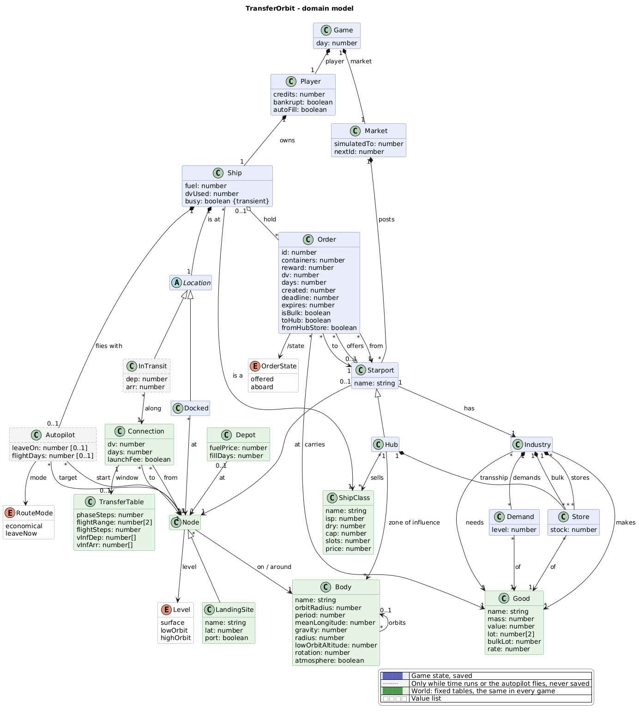

# Domain model

**This diagram leads.** The code follows it, never the other way round. A change to the model is
made here first, agreed, and then carried into the code; the diagram is never redrawn to match
what the code happens to do. Until the code has caught up, the gaps are listed under
*Where the code does not follow yet* at the end.

The source is [`domain-model.puml`](domain-model.puml) (PlantUML). After changing it, render the
picture again with `java -jar plantuml.jar -tpng docs/domain-model.puml`; it needs no Graphviz.

The diagram shows data and relations only, no operations. Blue is the game state that a save
keeps, grey with a dashed frame exists only while time runs or the autopilot flies and is never
saved, green is the world: fixed tables, the same in every game. White boxes are value lists.

## Rules the picture does not show

- **What stays out.** Game rules (hub capacity, launch fee per tonne, rescue time per hub, how much
  slower bulk goods come in) stay constants in the code. Data used only for display (colours,
  notes, longitudes, short names) may stay in the world tables beside the classes. Where the
  solar system map points its transfer window is interface state: it starts empty and is not saved.
- **Orders.** An order lies either in its starport's offers or in the ship's hold, never both;
  its state (`/state`) follows from where it lies. `from` and `to` stay the same wherever it lies.
- **Time at a place, time under way.** Every manoeuvre puts the ship in transit along a
  connection. `busy` means time passes while the ship stays where it is: waiting, refuelling,
  the shipyard, a rescue. Saving works only at a place with the clock stopped.
- **Connections with a transfer window** run between the high orbits of two planets. Their `dv`
  and `days` are the values at the ideal window: the least delta-v and the longest flight. Leaving
  on another day costs more and flies faster; how much follows from the two bodies' orbits and the
  departure day. All other connections always cost what they say.
- **Nodes on a surface are landing sites.** Every spaceport has its own starport; the Earth has
  four (Kourou, Cape Canaveral, Baikonur, Plesetsk).
- **Depots.** A depot in orbit is a fuel station (Earth orbit, Mars orbit); on a surface it is at
  a landing site that sells fuel.
- **Hubs.** A hub's zone of influence decides where goods for other zones are transhipped, which
  destinations the orders from its transhipment store serve, how long a rescue takes and which
  fuel prices the refuel panel lists. Every hub sells every ship class. Whether a hub has room
  counts its store only, not what the ship carries towards it.
- **Industry.** An industry makes and needs goods. For every good it makes there is a store for
  ordinary orders and one for bulk orders, for every good it needs a demand (`level` 0 to 3: how
  keen the starport is to get it). A good comes in at one container per `rate` days. Once the bulk
  store holds enough for a bulk order, a random test each day decides whether the order appears:
  likelier the closer the store gets to the good's `bulkLot`, certain at the largest size. The
  order takes the whole bulk store.
- **Autopilot.** `start` is where the trip began and stays for the whole trip: a delivery there is
  no reason to stop. `target` is where it ends.

## Where the code does not follow yet

The code in `js/game/` was written against an earlier model and departs from this one here:

- **Autopilot.** `start` may be missing and is cleared after the first step.
- **Levels** are called `surf`, `orbit` and `capt` in the code, the short forms the place ids
  (`mars.surf`) use, not `surface`, `lowOrbit` and `highOrbit`.
- **Starports** are built for each game from the `Post` table (name, node, site, makes, needs,
  hub) rather than being fixed objects, and they reach their definition through `def`. Their
  industry still keeps the lot size the next bulk order waits for (`bulkLot`), rolled at random
  and saved, instead of `Good.bulkLot` and a daily test.
- **Zones of influence** are the `REGION` table (body to hub id); the shipyard opens at any post
  flagged as a hub.
- **Connections** are computed in `game/actions.ts` and `game/graph.ts` from the body tables;
  there are no `Connection` objects and no `transferWindow` flag. Bodies are two tables (`B` for
  planets, `M` for moons) with short field names (`a`, `T`, `L0`, `mu`, `R`, `alt`).
- **Transit.** `InTransit` exists only for transfers between planets; every other manoeuvre is
  `busy` plus an animation.
- **Market.** There is no `Market.advance(day)`; `marketAdvance()` in `game/economy.ts` reads the
  global `S`. A hub's room (`hubRoom()`) also counts the orders in the ship's hold.
- **Orders** have no state to read; it is only where they lie.
- **Reference classes** carry their `world.ts` names: `ShipDef`, `GoodDef` (`m`, `w`, `sh`),
  `Post`, not `ShipClass`, `Good` and `Industry`.
- **`Location`** is a TypeScript union, not an abstract class.
- **Behaviour from outside.** The commands set `ship.busy`, fill a hub's store and change a
  post's need directly instead of asking the objects.
