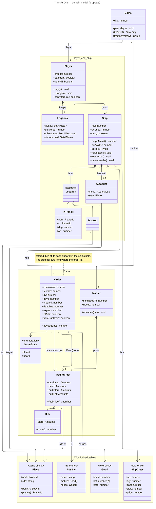

# Domain model (proposal)

The simulation state as objects that relate the way the things in the game do, instead of
the flat `S.domain`. This is a proposal: the code does not look like this yet.

- The **player** owns a **ship** and keeps a **logbook** (places visited, deliveries, milestones, depots used).
- The ship **is at** a **location**: either **docked** at a **place** (node and landing site) or
  **in transit** between two planets. Today that is `node:null` plus `S.action.transit`, two
  fields that have to agree.
- The ship's **hold** carries the orders it has taken aboard. A **trading post** **offers** orders,
  each going to a **destination** post. Where an order lies is its state.
- A trading post **sits at** a place and keeps what it produced and what it needs; a **hub** also
  stores goods for the region. Today these are the tables `produced`, `need` and `hubStore` in
  the market, keyed by post.
- The **market** advances the posts day by day and hands out order ids.
- The fixed tables from `game/world.ts` (ship classes, goods, post definitions, places) are referenced, never copied.

`Game` only holds the day and is where saving and loading start. The save can keep today's
format: `toSave()` collects the object graph back into the flat JSON.

