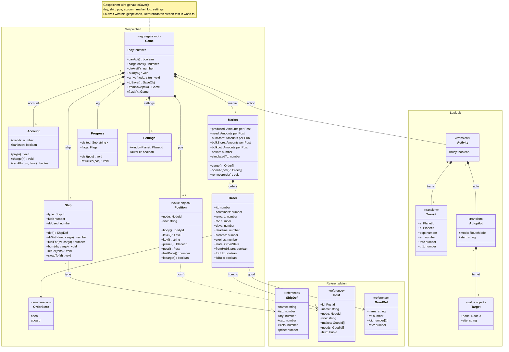

# Domain model (proposal)

The simulation state as objects instead of the flat `S.domain`. This is a proposal: the
code does not look like this yet. `Game` is the root; everything in *Gespeichert* is
written to a save by `toSave()`, in exactly today's format. *Laufzeit* is never saved,
*Referenzdaten* are the fixed tables in `game/world.ts`, referenced by id.

The order generation stays in `game/economy.ts` as `marketAdvance(market, day)`, and
`game/commands.ts` stays the layer that runs a move: guards, animation, `report()`,
`changed()`. The classes only do the immediate state change and keep its invariants.

